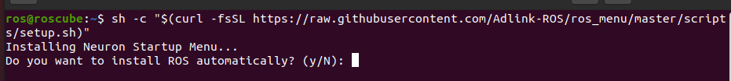
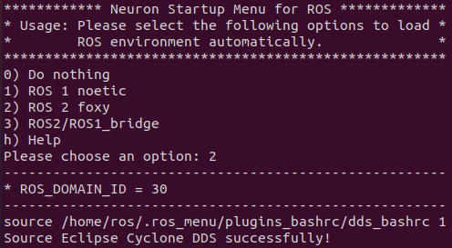

# Neuron Startup Menu

Setting ROS environment every time is an annoying job.
ADLINK provides Neuron Startup Menu to make your life easier.

Neuron Startup Menu offers these features:
1. Install ROS 1, ROS2, and Cyclone DDS for you automatically.

        

2. Prompt ROS menu whenever you opening a new terminal.

    


# Support Platform

* Ubuntu 18.04
  - ROS 1 melodic / ROS 2 dashing
* Ubuntu 20.04
  - ROS 1 noetic / ROS 2 foxy
* Ubuntu 22.04
  - ROS 2 humble
  
# Install

* Get Git tools if you haven't installed yet

```bash
sudo apt update
sudo apt install -y git curl
```

* There are two ways to install: install in native host / container

  - native host:

    ```bash
    sh -c "$(curl -fsSL https://raw.githubusercontent.com/Adlink-ROS/ros_menu/master/scripts/setup.sh)"
    ```
  
  - container

    ```bash
    # Add docker privilege to current user
    sudo apt install docker.io
    sudo groupadd docker
    sudo gpasswd -a $USER docker
    reboot
    # After reboot
    sh -c "MENU_CONFIG=ros_menu_20.04_container.yaml USE_CONTAINER=True $(curl -fsSL https://raw.githubusercontent.com/Adlink-ROS/ros_menu/main/scripts/setup.sh)"
    ```

* (Optional) you can add variables while downloading ros_menu.

```bash
# Select which version you want.
sh -c "MENU_VERSION=<Your Version> $(curl -fsSL https://raw.githubusercontent.com/Adlink-ROS/ros_menu/main/scripts/setup.sh)"
# Select which config you want.
sh -c "MENU_CONFIG=<Config Name> $(curl -fsSL https://raw.githubusercontent.com/Adlink-ROS/ros_menu/main/scripts/setup.sh)"
```

# Usage

* While you open a new terminal, it'll show the following menu.

```
************ Neuron Startup Menu for ROS *************
* Usage: Please select the following options to load *
*        ROS environment automatically.              *
******************************************************
0) Do nothing
1) ROS 1 noetic 
2) ROS 2 foxy 
3) ROS2/ROS1_bridge 
h) Help
Please choose an option:
```

* Here is what the menu does for us:

    - `Do nothing`:
        * Does not setup any environment.
    - `ROS noetic`:
        * Sets up the ROS 1 environment.
        * Sets the ROS_IP and ROS_MASTER_URI, which is your host IP.
    - `ROS 2 foxy`:
        * Sets up the ROS 2 environment.
        * Loads DDS settings and select the DDS you want to use.
    - `ROS2/ROS1_bridge`:
        * Sets up the ROS Bridge environment.
        * Runs ROS Bridge automatically.
    - `Help`:
        * Show using details of the ROS menu.
        * You can type `h` or `H` or `help` when choosing the option

# Configuration

You can configure the menu easily by modify ~/ros_menu/config.yaml.
The following are the options you can control.

* Enable menu:
  - menu_enable: "true" to enable the menu, “false” or otherwise do nothing.
* ROS option:
  - ros_option: “menu” to show the whole menu, or any option_num you set to choose the option automatically.
* ROS domian id:
  - default_ros_domain_id: set if you want to have the same domain ID for every ROS 2 version, otherwise the domain ID will be set to 30.
* Here are some parameters you need to set if you want to create a new option for your menu: 
  - ROS 1: 
    - option_num: give the option name to this option, avoid using specific characters(e.g:help,H,h,0) or duplicate option name 
    - ROS_version: 1
    - distro_name: the name of the ROS 1 you are using.
    - ros1_path: the path where the ROS 1 is.
    - master_ip: set the IP address of the master if master isn't on current computer.
    - container: if the option is set, then ros_menu will run container for ROS environment.
    - cmds: source your ROS 1 workspace here.
  - ROS 2:
    - option_num: give the option name to this option, avoid using specific characters(e.g:help,H,h,0) or duplicate option name 
    - ROS_version: 2
    - distro_name: the name of the ROS 2 you are using.
    - ros2_path: the path where the ROS 2 is.
    - domain_id: set the Domain ID for DDS communication. Keep empty to use `$default_ros_domain_id(30)`
    - container: if the option is set, then ros_menu will run container for ROS environment.
    - cmds: source your ROS 2 workspace here.  _Remarks: `source_plugin dds_bashrc` is necessary every time using ROS 2_
  - ROS2/ROS1_bridge:
    - option_num: give the option name to this option, avoid using specific characters(e.g:help,H,h,0) or duplicate option name 
    - ROS_version: bridge
    - ros1_version_name: the name of the ROS 1 you are using.
    - ros2_version_name: the name of the ROS 2 you are using.
    - ros1_path: the path where the ROS 1 is.
    - ros2_path: the path where the ROS 2 is.
    - master_ip: set the IP address of the master if master isn't on current computer.
    - domain_id: set the Domain ID for DDS communication. Keep empty to use `$default_ros_domain_id(30)`
    - container: if the option is set, then ros_menu will run container for ROS environment.
    - cmds: any command you want to run every time using ROS bridge. _Remarks: `source_plugin dds_bashrc` and `ros2 run ros1_bridge dynamic_bridge --bridge-all-topics` is necessary every time using ROS bridge_

# Upgrade

* It's very easy to upgrade the menu by typing `ros_menu_upgrade`.
* Optional: You can also select which version you want.

```sh
ros_menu_upgrade <version>
```

* Next time you open the terminal, it'll be new version.

# Disable/Enable the menu

* You could disable/enable the ros_menu by typing `ros_menu_disable` / `ros_menu_enable`

```sh
#Disable ros_menu
ros_menu_disable 
#Enable ros_menu
ros_menu_enable
```

# Uninstall

* If you don't want the ros_menu anymore, you can just type `ros_menu_uninstall`.
* Also remember to remove `source ~/.ros_bashrc` in your `~/.bashrc`.

# Issues Report

If you find any problems or have any suggestions, feel free to open issues on GitHub.

Issue URL: https://github.com/Adlink-ROS/ros_menu/issues
